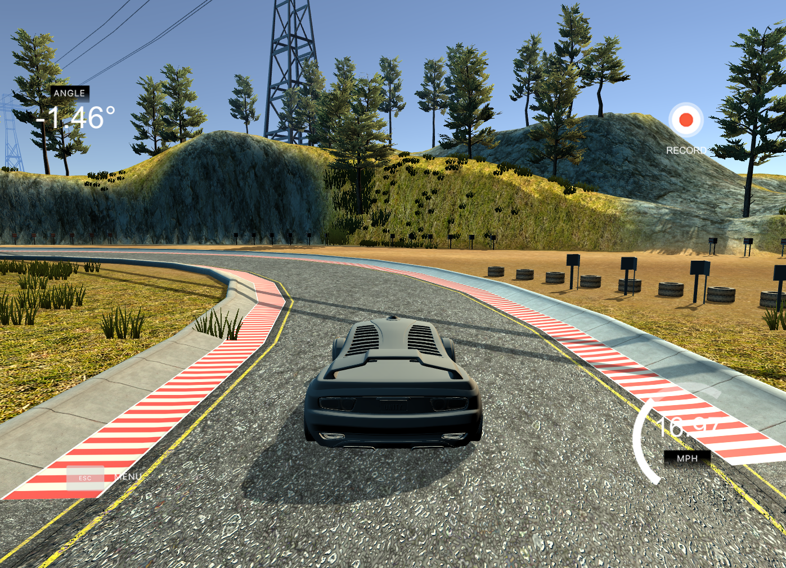
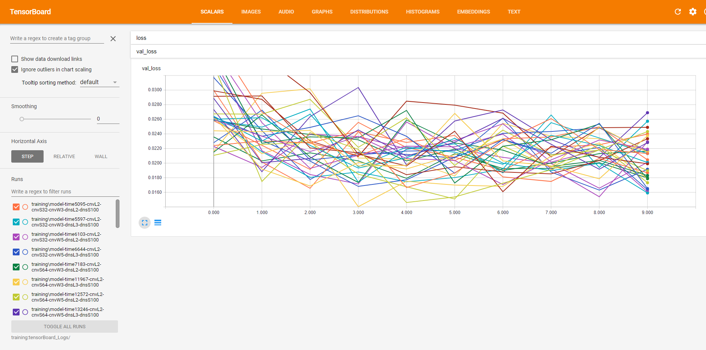
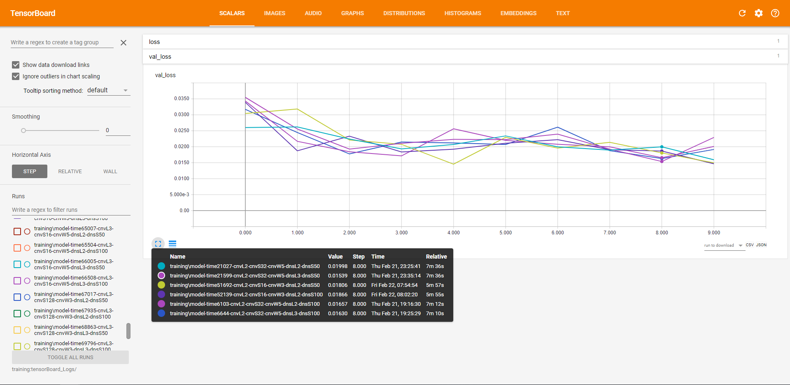

# Self Driving Car Simulation
I was inspired to do this project by Siraj Raval from YouTube. 

## Overview

In this project I will be using a Neural Network to drive a car around a track in a simulator. The simulator we're going to use Udacity's [self driving car simulator](https://github.com/udacity/self-driving-car-sim) as a testbed for training an autonomous car. Along with the simulator I was provided a pre-trained model, I will be attempting to outperform this model. 


During this project I tried to determine which model would be the best to train based on their performance by varying a variety of factors including, number of convolutional layers, number of convolutional nodes, size of convolutional window, number of dense layers, nuumber of dense nodes.

## Usage
The models that I will be posting can be run by running the commands below
### Training 
python model.py -d Training_Data\2_Laps_Desert_Track -l 2.0e-4 -o false -n 10

### Driving/Testing Best Models Below 
python drive.py Saved_Models\model-V1.02.h5 

python drive.py Saved_Models\model-V1.08\model-008.h5 

python drive.py Saved_Models\model-V1.13\model-009.h5 

python drive.py Saved_Models\model-V1.14\model-008.h5

### Progress Tracking
tensorboard --logdir=training:tensorBoard_Logs/ --host=127.0.0.1

## Model Versions
### Current Best Model: model-V1.02 and model-V1.08-Epoch-8 and model-V1.13-Epoch 10

1.	**model-Pre-Trained** - Pre-trained model created

This model performs fairly well from the beginning, it stays on the track the entire time.

2.	**model-V1.00** - Model trained using 2 laps of desert test data and 2 epochs and learning rate of 1.0e-4

This model performed poorly, did mild amounts of steering but encountered issues with sharp turns and swayed within the lane. 

3.	**model-V1.01** - Model trained using 2 laps of desert test data and 10 epochs and learning rate of 1.0e-4

This model performed poorly, but was able to complete half a lap, did not experience the swaying as much as the V1.00 model.

4.	**model-V1.02** - Model trained using 2 laps of desert test data and 10 epochs and learning rate of 2.0e-4

This model performed extremely well, the faster learning rate helped the algorithm tune its self much better and was able to perform on par with the Pre-trained model. I was fairly surprised that such a small change could affect the outcome of the model so much.
Testing model-V1.02 on a track that it has never seen before yielding unexpected results the neural network was able to manage part of the course which is surprising since many other models couldn’t make it past the first turn.

5.	**model-V1.03** - Model trained using 2 laps of desert test data and 10 epochs and learning rate of 1.0e-3

For this model I had the idea that since increasing the training rate in my last example improved the output model by a lot. I researched other training rates, many suggested to increment by a factor of 10. 
The results were quite surprising to me since the model performed extremely bad. It could not turn properly and appeared to have learned nothing. This is most likely to the fact that when using gradient decent if the learning rate is to high the steps it takes are to large and thus does not learn quickly

6.	**model-V1.04** - Model trained using 2 laps of desert test data and 10 epochs and learning rate of 5.0e-4

As expected, the training rate was way to high and the model moved forward with a slight steer to the right. I found this interesting because most of the track consists of the model steering to the left. Similarly, to model-V1.03, the model moved straight with a slight steer to the right. This could mean there are issues in the testing data.

7.	**model-V1.05** - Model trained using 5 laps of desert test data and 10 epochs and learning rate of 2.0e-4

This model was trained based on 5 laps from the desert track meaning it has a larger dataset to learn from and hopefully from that we will be able to see some improvements. The model turned out to be a big disappointment, I thought that with more data it would be able to perform better. Testing on another track yielded similar results, this model performed poorly. Model was unable to make it around the first turn under different conditions. 

8. **model-V1.06** - Model trained using 5 laps of desert test data and 10 epochs and learning rate of 2.0e-4

This model was used to see how the neural network changes after each Epoch and helped me understand the difference between loss and val_loss. More results can be seen in the section "Evaluation of how Epochs change the model".

9. **model-V1.07** - Model trained using 2 laps of desert test data and 30 epochs and learning rate of 1.5e-4

This model was a more prolonged study to see how the neural network changes after each Epoch and helped me understand the difference between loss and val_loss. This test showed produced very similar results to *model-V1.06*, when tested one the desert track. Around epoch 15 the model was able to comfortably make laps on the desert track. All models after that were also able to make full laps. However, when I tested the model against a new enviroment the forest track, I found that epoch 15 was able to perform better than all the models after it. This is the problem of overfitting. The later models were unable to detect the road on the forest track and couldn't make it past the first turn. 

10. **model-V1.08** - Model trained using 2 laps of desert test data and 10 epochs and learning rate of 2.0e-4, test a different activation function ReLU.

This model with the ReLU activation function seems to learn at a faster rate, after epoch 5 the model was able to complete the laps. The best model from this model version was easily able to complete laps on the track. 

11. **model-V1.09** - Model trained using 2 laps of desert test data and 10 epochs and learning rate of 2.0e-4, test a different activation function eLU and loss function changed to mean_absolute_error.

Upon initial inspection the model seems to have trained better than with the loss function being mean_squared_error. This is just by looking at the loss values generated. My initial prediction was completely wrong the mean absolute error performed much worse, the car was unable to make it past the first sharp turn and many models were had difficult making it past small turns. I will most likely stick with the mean squared error loss function for the future. 

12. **model-V1.10** - Model trained using 2 laps of desert test data and 10 epochs and learning rate of 2.0e-4, test a different activation function eLU and loss function changed to mean_absolute_error. This model also used dropout of 20% after each layer of the network. 

This model performed very similarly to models before however still had some issues with the first turn. This may be due to the input data being wrong or misleading. 

13. **model-V1.11** - Model trained using 2 laps of desert test data and 10 epochs and learning rate of 2.0e-4, test a different activation function eLU and loss function changed to mean_squared_error. However, this model used no drop out.

14. **model-V1.12** - Model trained using 2 laps of desert test data and 10 epochs and learning rate of 2.0e-4, test a different activation function eLU and loss function changed to mean_absolute_error. This model also used dropout of 50% after each layer of the network. 

This network failed completely most likely because the drop out rate was way to high, at 50% for each layer the network was only able to go straight and turn slightly after 8 epochs. 

15. **model-V1.13** - Model trained using 2 laps of desert test data and 10 epochs and learning rate of 2.0e-4, test a different activation function ReLU and loss function changed to mean_squared_error. This model also used dropout of 20% after each layer of the network. 

With the 20% drop out rate the model performed very well, after the 5th epoch the model was able to complete full laps and the later models were able to be completely centered throughout the entire track. The drop out rate that I initially used was to high and caused the machine to not learn anything since the half the network nodes were gone.

16. **model-V1.14** - Model trained using 2 laps of desert test data and 10 epochs and learning rate of 2.0e-4, test a different activation function ReLU and loss function changed to mean_squared_error. This model also used dropout of 50% after each layer of the network. In addition, I added Maxpooling layers after the 3rd convolution and just before the convolution outputs are feed into the network.

Model-V1.14 the training stats of this model looked very similar to many of the previous successful models I trained. This was very promising, however when I saw the size of the file, I was a little concerned since the model size was about half the size of the previous models. Upon testing the model, I was pleasantly surprised it was easily able to complete the track and controlled the car in a steady manor.

17. Created 64 different models to test different parameters. The different parameters I checked for were number convolutional layers, convolutional layer size, convolutional window size, number of dense neural network layers, size of the dense neural network.

Initally I had 64 different models which was a mess on TensorBoard:


For my evaluation of the stats I have determined 6 neural networks that were able to perform the best as shown below, and then I looked at the parameters given and looked for the most common ones.

Of these 6 models their parameters are given in the table below.
number convolutional layers(cnvN)
convolutional layer size(cnvS)
convolutional window size(cnvW)
number of dense neural network layers(dnsN)
size of the dense neural network(dnsS)

| cnvN	| cnvS 	| cnvW 	| dnsN 	| dnsS 	|
| -----	| -----	| -----	| -----	| -----	|
|	2	|  32	| 	5	| 	2	| 	50	|
|	2	|  32	| 	5	| 	2	|  100	|
|	2	|  32	| 	5	| 	3	| 	50	|
|	2	|  32	| 	5	| 	3	|  100	|
|	2	|  16	| 	3	| 	2	|  50	|
|	2	|  16	| 	3	| 	2	|  100	|

Based on the above stats I think we can look at the models and say that our ideal model would have 2 cnvN, 32 cnvS, 5 cnvW, 2 dnsN, and 50 or 100 dnsS.
I will do some more testing to see if my tests were through enough.


## Lessons Learned
### Learning rate: 
Learning rates have large effects on the outcome of the models, in model-V1.01 I used a Learning rate of 1.0e-4 which resulted in a model that was able to complete half a lap in the simulator. In the next model-V1.02 I doubled the Learning rate and the model was able to complete laps flawlessly which was a huge improvement from for a minor change. Upon analyzing the epochs, I noticed that when the Learning rate was ideal a steady decline in the loss and val_loss functions can be seen below:

Training Model with learning rate 2.0e-4
```
20000/20000 [==============================] - 135s - loss: 0.0407 - val_loss: 0.0233
Epoch 2/10
20000/20000 [==============================] - 114s - loss: 0.0381 - val_loss: 0.0221
Epoch 3/10
20000/20000 [==============================] - 111s - loss: 0.0366 - val_loss: 0.0228
Epoch 4/10
20000/20000 [==============================] - 112s - loss: 0.0335 - val_loss: 0.0238
Epoch 5/10
20000/20000 [==============================] - 111s - loss: 0.0320 - val_loss: 0.0255
Epoch 6/10
20000/20000 [==============================] - 111s - loss: 0.0305 - val_loss: 0.0234
Epoch 7/10
20000/20000 [==============================] - 111s - loss: 0.0294 - val_loss: 0.0238
Epoch 8/10
20000/20000 [==============================] - 112s - loss: 0.0288 - val_loss: 0.0230
Epoch 9/10
20000/20000 [==============================] - 112s - loss: 0.0287 - val_loss: 0.0172
Epoch 10/10
20000/20000 [==============================] - 112s - loss: 0.0262 - val_loss: 0.0182
```
### Size of Data
From my current experiment there were not any improved results from training the networks on a larger data set. In fact, the models trained on the larger data sets performed worse than those trained on the smaller datasets which I did not expect. The models trained on larger datasets would have had more experience and should experience the overfitting problem less. This most likely has to do with the complexity of the neural network, if its a larger network then more data will be required to adjust the weights.

More experimentation is required.

### Evaluation of how Epochs change the model
20000/20000 [==============================] - 117s - loss: 0.0313 - val_loss: 0.0134
Using *model-V1.06* I used keras.callbacks to create checkpoints of how every epoch changes the behavior of the model. Looking at the training stats below one may assume that after the 4th Epoch(loss: 0.0313 - val_loss: 0.0134) would yield the highest performance due to the extremely low val_loss of 0.0134 which was the lowest out of the batch however when testing this model it was unable to make sharp turns and was swaying back and fourth in the lane.

When testing the after the 6th Epoch the model fixed the swaying issue noticed in the previous versions and was able to make it 3/4ths the way through the track, getting stuck on the sharp right turn. Which I noticed was an issue with all the other version. None of these models were able to complete an entire lap. 
```
20000/20000 [==============================] - 118s - loss: 0.0357 - val_loss: 0.0169
Epoch 2/10
20000/20000 [==============================] - 117s - loss: 0.0336 - val_loss: 0.0194
Epoch 3/10
20000/20000 [==============================] - 116s - loss: 0.0332 - val_loss: 0.0205
Epoch 4/10
20000/20000 [==============================] - 117s - loss: 0.0313 - val_loss: 0.0134
Epoch 5/10
20000/20000 [==============================] - 117s - loss: 0.0305 - val_loss: 0.0147
Epoch 6/10
20000/20000 [==============================] - 117s - loss: 0.0292 - val_loss: 0.0176
Epoch 7/10
20000/20000 [==============================] - 117s - loss: 0.0293 - val_loss: 0.0147
Epoch 8/10
20000/20000 [==============================] - 117s - loss: 0.0293 - val_loss: 0.0145
Epoch 9/10
20000/20000 [==============================] - 117s - loss: 0.0281 - val_loss: 0.0143
Epoch 10/10
20000/20000 [==============================] - 118s - loss: 0.0278 - val_loss: 0.0172
``` 
#### Overfitting
When testing *model-V1.07* around epoch 15 the model was able to comfortably make laps on the desert track. All models after that were also able to make full laps on this track. However, when I tested the model against a new environment the forest track, I found that epoch 15 was able to perform better than all the models after it that had more training and better loss function scores. The later models were unable to detect the road on the forest track and couldn't make it past the first turn. This is the problem of overfitting. 


### Activation Functions
The activation function ReLU seemed to learn quicker than the eLU activation function. More testing is required, after epoch 5 the model was able to successfully complete laps on the Desert track. When I tested the model on the Forest track the new activation function performed worse when handling unexpected. 

### Loss Functions
I tried a few loss functions however they all performed worse than the mean squared error that I had been using all along. Looking at graphs of the loss functions I tried I can see why they would perform worse than the mean squared error since their slope are all lower/not as steep. 

### Drop out rate
Drop out rate is a useful property that allows every node in the network to get a chance to contribute to the end outputs and prevents one single node from making all the decisions. The drop out rate is a value that needs to be tuned very carefully, if the drop out rate is too high the network will fail to learn anything.

### Maxpooling 


## Future Steps:
1.	Add Lane Detection
2. Get more tracks so model will be tested against completely unseen levels and thus it build a more diverse test set and hopefully learn to be a generalized model. 
3. Run the multi-model perfomance testing against a larger data set, 5 laps with smaller batch sizes and more epochs
4. Try out a Residual Neural Network structure
5. Change code so the network gets 3 images(left, front, right) as the processing, not just one image


